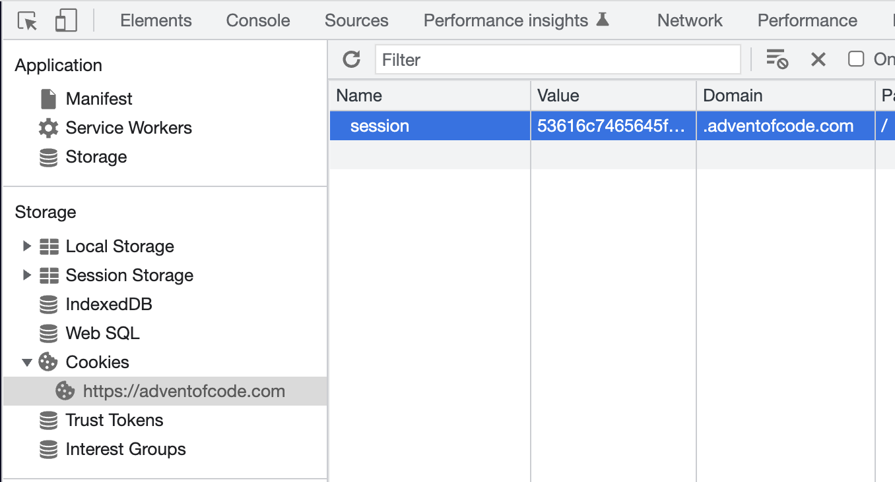
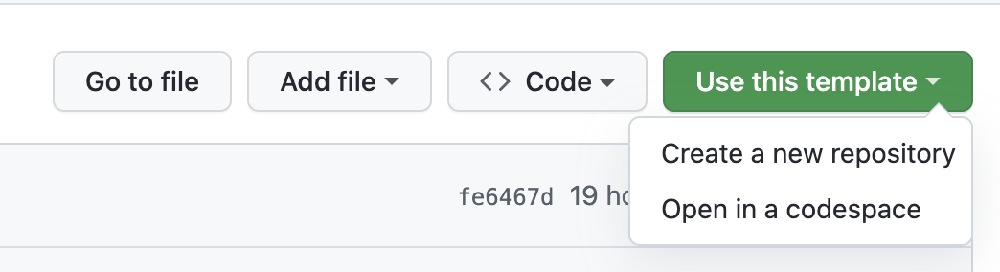
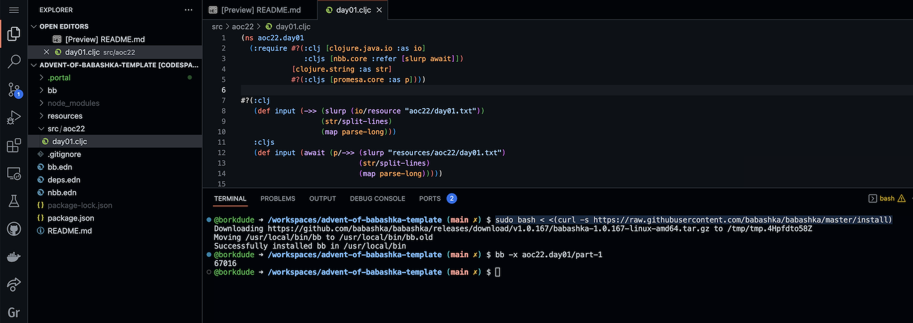

# Advent of Babashka

A project for doing [Advent of Code](https://adventofcode.com/) using
[babashka](https://github.com/babashka/babashka) and
[nbb](https://github.com/babashka/nbb).

To install babashka, check [here](https://github.com/babashka/babashka#installation). It is recommended to use version 1.0.167 or higher.
To install nbb: `npm install -g nbb@latest`. Nbb 1.1.151 or higher is required.

The first puzzle is in `src/aoc22/day01.cljc`. You can execute part 1 in both `bb` and `nbb` using:

```
$ bb -x aoc22.day01/part-1 [...args]
$ nbb -x aoc22.day01/part-1 [...args]
```

Each solution can take parameters from the command line if necessary.  Arguments
are parsed using
[babashka.cli](https://github.com/babashka/cli/blob/main/src/babashka/cli.cljc):

```
$ bb -x clojure.core/prn --flag --option 1
{:flag true, :option 1}
```

You can also use Clojure JVM with the same argument parsing:

```
clj -M:cli clojure.core/prn --flag --option 1
{:flag true, :option 1}
```

## Generating stub for new day

To generate a stub for a new day, run:

```
$ bb new-day --year 22 --day 2
```

The `--year` currently defaults to `22`.

## Downloading input

To download your puzzle input from the Advent of Code website automatically, set
the `AOC_SESSION` environment variable to your Advent of Code session
cookie. You can find this by going to your browser's developer console.



You can also just download your puzzle input manually.

## Github Codespaces

To use this template in Github Codespaces, click Use this template > Open in a codespace.



To install babashka, run

```
sudo bash < <(curl -s https://raw.githubusercontent.com/babashka/babashka/master/install)
```

To install nbb, run:

```
npm install -g nbb@latest
```



## Nbb startup

If you want to install `nbb` locally in the project, run `npm install
nbb@latest` and use `node_modules/.bin/nbb` instead run nbb (this starts
faster than `npx nbb`).

## External tools

- [Create AoC badges](https://github.com/genmeblog/advent-of-code/blob/master/badges/badges.bb)

# License

This code is unlicensed, you can fork / clone it and use it however you want.
